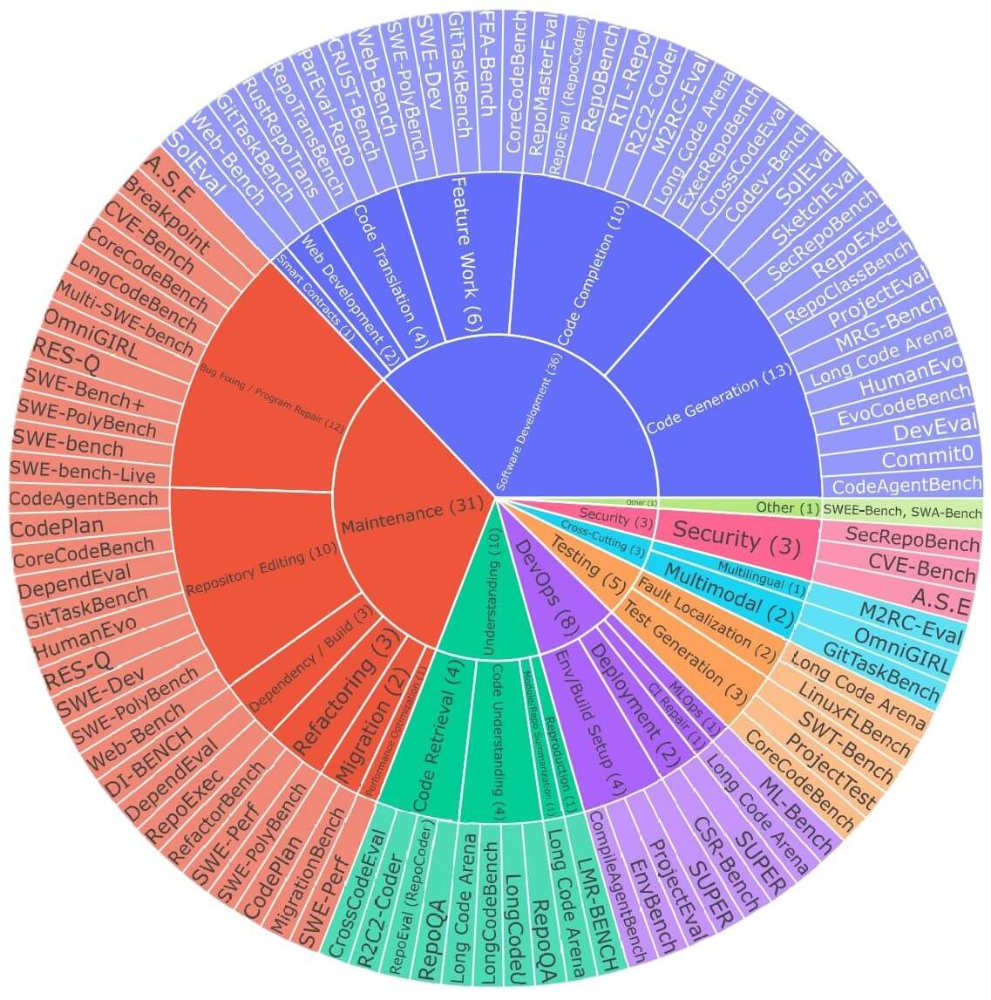

# Awesome-Repo-Level-Code-LLM-Benchmarks
List of repo-level benchmarks for evaluating coding abilities of LLMs — datasets, leaderboards, papers, and tooling. 

## The List (auto-generated)
This section is rendered from `/data/benchmarks.json` by `/scripts/build_readme.py`.

<!-- START:LIST -->
- **A.S.E** (2025) — Secure code generation/patching at repository level (CVE-grounded); langs: Java, Python, Go, JavaScript, PHP; runner: exec
  [paper](https://arxiv.org/abs/2508.18106)

- **Breakpoint** (2025) — Repo-context code repair via synthetic inverse corruptions (with tests); langs: Python; runner: exec
  [paper](https://arxiv.org/abs/2506.00172)

- **CodeAgentBench** (2024) — Repo-level code generation with tool-integrated agent (5 projects, 101 samples); langs: Python; runner: exec
  [paper](https://arxiv.org/abs/2401.07339)

- **CodePlan** (2024) — Planning-driven repository-wide editing (package migration, temporal edits); langs: C#, Python; runner: exec
  [paper](https://arxiv.org/abs/2309.12499)

- **Codev-Bench** (2024) — Developer-centric code completion in real repos (auto-updating); langs: Python; runner: exec
  [paper](https://arxiv.org/abs/2410.01353)

- **Commit0** (2024) — End-to-end library generation from specs with interactive feedback (tests, static analysis, coverage); langs: Python; runner: exec
  [paper](https://arxiv.org/abs/2412.01769)

- **CompileAgentBench** (2025) — Repository build/compile automation with a tool-integrated agent; langs: C, C++; runner: exec
  [paper](https://aclanthology.org/2025.acl-long.103.pdf)

- **CoreCodeBench** (2025) — Configurable multi-scenario repo benchmark (Dev, BugFix, TDD composite tasks via CorePipe); langs: Python; runner: exec
  [paper](https://arxiv.org/abs/2507.05281)

- **CrossCodeEval** (2023) — Cross-file code completion and retrieval evaluation (10k examples, ~1k repos); langs: Python, Java, TypeScript, C#; runner: proxy
  [paper](https://arxiv.org/abs/2310.11248)

- **CRUST-Bench** (2025) — C-to-safe-Rust transpilation at repo scale (idiomatic memory-safe translation); langs: C, Rust; runner: exec
  [paper](https://arxiv.org/abs/2504.15254)

- **CSR-Bench** (2025) — End-to-end deployment of CS research repos (env setup, data prep, training, inference); langs: Bash; runner: exec
  [paper](https://arxiv.org/abs/2502.06111)

- **CVE-Bench** (2025) — Repair real-world CVE vulnerabilities with agents in realistic repo environments; langs: Python, Java, JavaScript, PHP; runner: exec
  [paper](https://aclanthology.org/2025.naacl-long.212/)

- **DependEval** (2025) — Dependency understanding benchmark (recognition, construction, editing tasks); langs: C, C++, C#, TypeScript, JavaScript, Java, PHP, Python; runner: proxy
  [paper](https://arxiv.org/abs/2503.06689)

- **DevEval** (2024) — Repository-level code generation on real repos (manual annotations of requirements); langs: Python; runner: exec
  [paper](https://arxiv.org/abs/2405.19856)

- **DI-BENCH** (2025) — Dependency inference for runnable repos (identify internal/external deps); langs: Python, C#, Rust, JavaScript; runner: mixed
  [paper](https://arxiv.org/abs/2501.13699)

- **EnvBench** (2025) — Environment setup for software repositories (Python & JVM build/run configuration); langs: Python, Java, Kotlin; runner: exec
  [paper](https://arxiv.org/abs/2503.14443)

- **EvoCodeBench** (2024) — Evolving repository-aligned codegen benchmark (reduces time-leakage); langs: Python; runner: exec
  [paper](https://arxiv.org/abs/2404.00599)

- **ExecRepoBench** (2024) — Executable repo-level code completion (multi-level masking, cross-file context); langs: Python; runner: mixed
  [paper](https://arxiv.org/abs/2412.11990)

- **FEA-Bench** (2025) — Repo-level incremental feature implementation tasks (PR-style feature additions); langs: Python; runner: exec
  [paper](https://arxiv.org/abs/2503.06680)

- **GitTaskBench** (2025) — Real-world multi-modal project tasks solved by agents via repo tooling; langs: Python; runner: exec
  [paper](https://arxiv.org/html/2508.18993v1)

- **HumanEvo** (2025) — Evolution-aware repo-level code generation (time-aware context, exec tests); langs: Python, Java; runner: exec
  [paper](https://arxiv.org/abs/2406.06918)

- **LinuxFLBench** (2025) — Fault localization for Linux kernel bugs (file-level localization tasks); langs: C; runner: proxy
  [paper](https://arxiv.org/abs/2505.19489)

- **LMR-BENCH** (2025) — Repo-situated function implementation tasks from NLP research papers (masked functions); langs: Python; runner: mixed
  [paper](https://arxiv.org/abs/2506.17335)

- **Long Code Arena** (2024) — Six long-context, project-wide tasks (codegen, CI build repair, completion, commit msg gen, bug localization, summarization); langs: Python; runner: mixed
  [paper](https://arxiv.org/abs/2406.11612)

- **LongCodeBench** (2025) — Long-context repo QA (issue threads) + bug-fixing with up to 1M token context; langs: Python; runner: mixed
  [paper](https://arxiv.org/abs/2505.07897)

- **LongCodeU** (2025) — Long code understanding tasks (unit perception, intra/inter-unit relations, long-doc); langs: Python; runner: proxy
  [paper](https://arxiv.org/abs/2503.04359)

- **M2RC-Eval** (2025) — Massively multilingual repo-level code completion with fine-grained labels (18 languages); langs: C, C#, C++, Go, HTML, Haskell, Java, JavaScript, Kotlin, Lua, Objective-C, PHP, Python, R, Ruby, Rust, Scala, TypeScript; runner: proxy
  [paper](https://arxiv.org/abs/2410.21157)

- **MigrationBench** (2025) — Repository-level code migration from Java 8 to Java 17/21 (build/test evaluation); langs: Java; runner: exec
  [paper](https://arxiv.org/abs/2505.09569)

- **ML-Bench** (2025) — Repo-scale ML tasks (read code & compose new executable scripts, agentic eval); langs: Python, Bash; runner: exec
  [paper](https://arxiv.org/abs/2311.09835)

- **MRG-Bench** (2025) — Multi-language repository-level code generation (project-runnable tests); langs: Python, Java, Go; runner: exec
  [paper](https://arxiv.org/abs/2508.02998)

- **Multi-SWE-bench** (2025) — Multilingual repo-level issue resolution (patch generation) across 7 languages; langs: Java, TypeScript, JavaScript, Go, Rust, C, C++; runner: exec
  [paper](https://arxiv.org/pdf/2504.02605)

- **OmniGIRL** (2025) — Multilingual & multimodal issue resolution (text+images); langs: Python, JavaScript, TypeScript, Java; runner: exec
  [paper](https://arxiv.org/abs/2505.04606)

- **ParEval-Repo** (2025) — Whole-codebase translation across GPU programming models (CUDA↔OpenMP/Kokkos); langs: CUDA, OpenMP/Kokkos; runner: exec
  [paper](https://arxiv.org/abs/2506.20938)

- **ProjectEval** (2025) — Project-level programming agent evaluation (automated exec + user-interaction simulation); langs: Python; runner: exec
  [paper](https://arxiv.org/abs/2503.07010)

- **ProjectTest** (2025) — Project-level unit test generation across multi-file projects; langs: Python, Java, JavaScript; runner: exec
  [paper](https://arxiv.org/abs/2502.06556)

- **R2C2-Coder** (2024) — Repo-level code completion with retrieval-augmented prompts (R2C2-Bench & Enhance); langs: Python, Java, TypeScript, C#; runner: proxy
  [paper](https://arxiv.org/abs/2406.01359)

- **RefactorBench** (2025) — Multi-file refactoring tasks (stateful, long-horizon agent edits); langs: Python; runner: proxy
  [paper](https://arxiv.org/abs/2503.07832)

- **RepoBench** (2024) — Repo-level code autocompletion across files (with retrieval, next-line, pipeline); langs: Python, Java; runner: proxy
  [paper](https://arxiv.org/abs/2306.03091)

- **RepoClassBench** (2024) — Class generation inside real repos (with cross-file deps & tests); langs: Java, Python, C#; runner: exec
  [paper](https://arxiv.org/html/2405.01573v2)

- **RepoEval** (2023) — Repo-level code completion via iterative retrieval-generation (line, API, function); langs: Python; runner: mixed
  [paper](https://arxiv.org/abs/2303.12570)

- **RepoExec** (2024) — Repo-level code generation with explicit dependencies (executable benchmark); langs: Python; runner: exec
  [paper](https://arxiv.org/abs/2406.11927v2)

- **RepoMasterEval** (2024) — Test-validated code completion in real repos (with mutation testing); langs: Python, TypeScript; runner: exec
  [paper](https://arxiv.org/abs/2408.03519)

- **RepoQA** (2024) — Long-context repository code understanding (NL query → function search); langs: Python, C++, Java, TypeScript, Rust; runner: proxy
  [paper](https://arxiv.org/abs/2406.06025)

- **RepoTransBench** (2024) — Full repository code translation (Python→Java) with executable test suites; langs: Python, Java; runner: exec
  [paper](https://arxiv.org/abs/2412.17744)

- **RES-Q** (2024) — Natural-language repo editing (patching) verified by tests; langs: Python, JavaScript; runner: exec
  [paper](https://arxiv.org/abs/2406.16801)

- **RTL-Repo** (2024) — Verilog/RTL repository-level autocompletion (line-level EM/ES metrics); langs: Verilog; runner: proxy
  [paper](https://arxiv.org/pdf/2405.17378)

- **RustRepoTrans** (2025) — Repo-context code translation to Rust (functions with cross-file deps, unit tests); langs: C++, Java, Python, Rust; runner: exec
  [paper](https://arxiv.org/abs/2411.13990)

- **SecRepoBench** (2025) — Secure code generation inside real C/C++ repos (15 CWE-based tasks); langs: C, C++; runner: exec
  [paper](https://arxiv.org/abs/2504.21205)

- **SketchEval** (2024) — NL2Repo repository generation (3-stage pipeline: RepoSketcher, FileSketcher, SketchFiller); langs: Python; runner: proxy
  [paper](https://arxiv.org/abs/2403.16443)

- **SolEval** (2025) — Smart-contract repository-level code generation benchmark with security & gas metrics; langs: Solidity; runner: proxy
  [paper](https://arxiv.org/abs/2502.18793)

- **SUPER** (2024) — End-to-end repo setup & execution for ML/NLP research code (env, data, train, inference); langs: Python; runner: exec
  [paper](https://arxiv.org/abs/2409.07440)

- **SWE-bench** (2024) — Resolve real GitHub issues by editing repos to make tests pass; langs: Python; runner: exec
  [paper](https://arxiv.org/abs/2310.06770)

- **SWE-Bench+** (2024) — Audit and improve SWE-bench data quality (leakage/weak-test analysis); langs: Python; runner: exec
  [paper](https://arxiv.org/abs/2410.06992)

- **SWE-bench-Live** (2025) — Continuously updating repo-level issue resolution benchmark (monthly refreshes); langs: Python; runner: exec
  [dataset](https://swe-bench-live.github.io/)

- **SWE-Dev** (2025) — Feature-driven development benchmark (feature addition tasks with tests, train/test splits); langs: Python; runner: exec
  [paper](https://ar5iv.org/abs/2505.16975)

- **SWE-Perf** (2025) — Repo-level performance optimization (improve runtime via PR patches); langs: Python; runner: exec
  [paper](https://arxiv.org/html/2507.12415v1)

- **SWE-PolyBench** (2025) — Multi-language repo-level agent eval (bug fixes, feature adds, refactors); langs: Java, JavaScript, TypeScript, Python; runner: mixed
  [paper](https://arxiv.org/abs/2504.08703)

- **SWEE-Bench & SWA-Bench** (2025) — Auto-generated repo benchmarks via SetUpAgent (extended SWE-bench and application bench); langs: Python; runner: exec
  [paper](https://icml.cc/virtual/2025/poster/43922)

- **SWT-Bench** (2024) — Repo-grounded bug reproduction via test generation and validation; langs: Python; runner: exec
  [paper](https://proceedings.neurips.cc/paper_files/paper/2024/hash/94f093b41fc2666376fb1f667fe282f3-Abstract-Conference.html)

- **Web-Bench** (2025) — Sequential, project-scale web development tasks (50 projects × 20 tasks each); langs: JavaScript, TypeScript, HTML, CSS; runner: exec
  [paper](https://arxiv.org/abs/2505.07473)
<!-- END:LIST -->
## Benchmarks Mapped to SDLC

Click the image to explore the interactive version.

